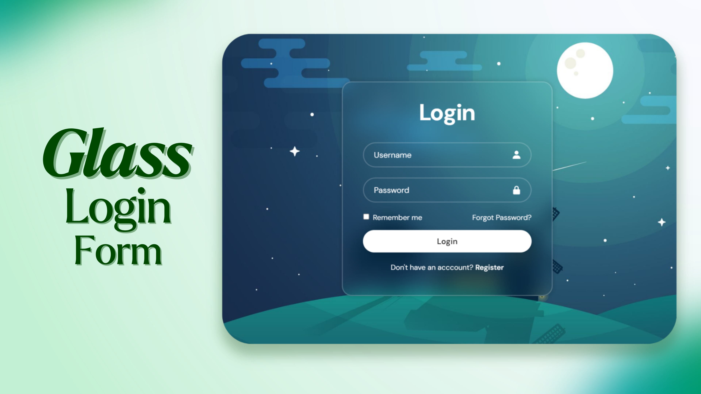

# Responsive Login Form

## Description
This is a login form created using HTML and CSS. It provides a simple yet elegant interface for users to log in to a system.

## Features
- Responsive design
- Username and password input fields
- Remember me checkbox
- Forgot password link
- Registration link

## Getting Started
1. Clone this repository to your local machine.
2. Open the `index.html` file in a web browser to view the login form.
3. Customize the form as needed for your project.

## Support
For support or inquiries, please contact me via:
- Email: inquery.saurav@gmail.com
- LinkedIn: [Saurav Chaturvedi](https://www.linkedin.com/in/isaurav/)

## Preview

